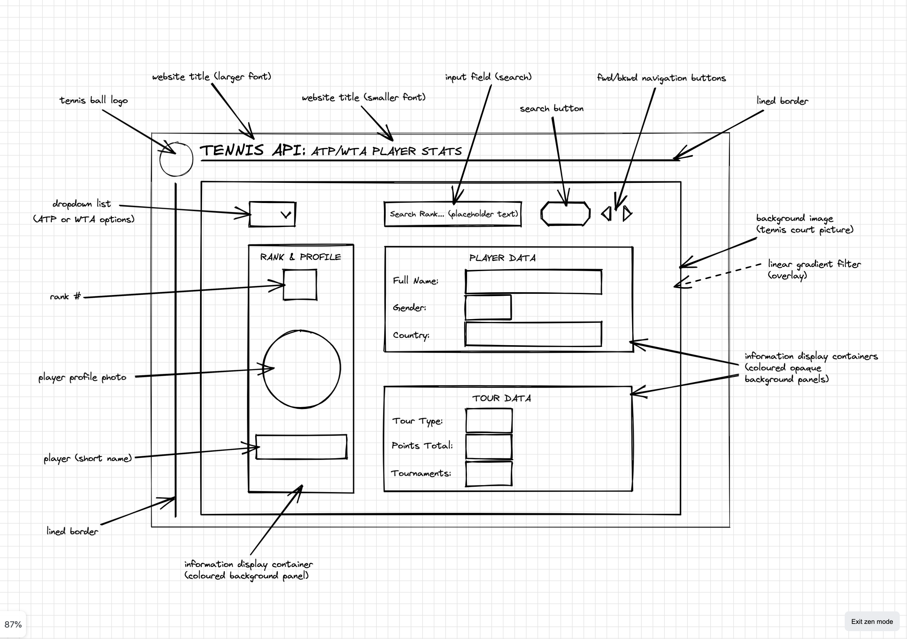
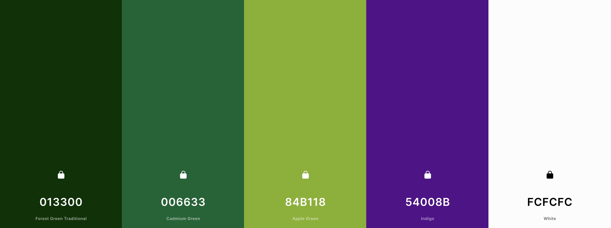
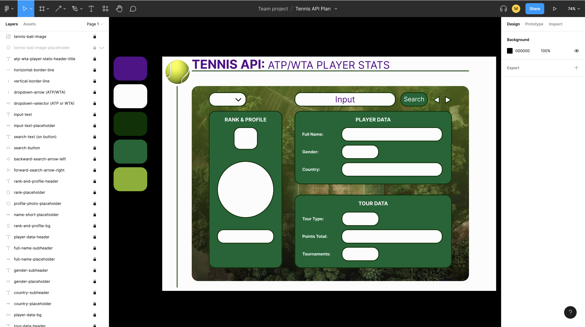

# tennis-api

Small project using basic HTML, CSS &amp; JavaScript to practice fetching data from an API and displaying it on a bespoke webpage (designed using Excalidraw, Figma and Coolors).

### Low Fidelity Design (Excalidraw)

### Web Page Colour Palette (used Coolors to find & select colour scheme)

#### Hex Codes Key (to indicate how the colours will be used across our web page design)

- Hex Code #54008B = txt-primary
- Hex Code #FCFCFC = txt-variant
- Hex Code #013300 = txt-secondary-and-borders
- Hex Code #006633 = buttons-and-stats-bg
- Hex Code #84B118 = stats-main-bg

### High Fidelity Design (Figma)

